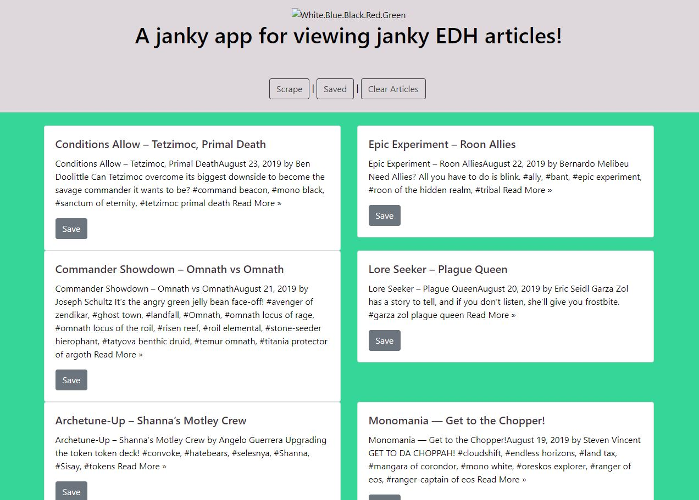

# [edhrecnews](https://github.com/alexlo15/edhrecnews)
RU-SOM-FSF-FT-06-2019-U-C | HW #12

___

## Motivation
To create an application combining use of MongoDB and a web scraper API.

**Built with:**
* [Node](https://nodejs.org/en/)
* [express](https://expressjs.com/)
* [MongoDB](https://www.mongodb.com/)

## npm Packages used:

* article
* articles
* axios
* cheerio
* dotenv
* express
* express-handlebars
* morgan
* mongoose

## Features
Website features: 

1. SignIn Page
2. Flashcards
3. Drag & Drop Quiz
4. Memory Match
5. Whiteboard
6. Leaderboard

## License
A short snippet describing the license (MIT, Apache etc)

RU © 
[Alex Lo](https://github.com/alexlo15)

